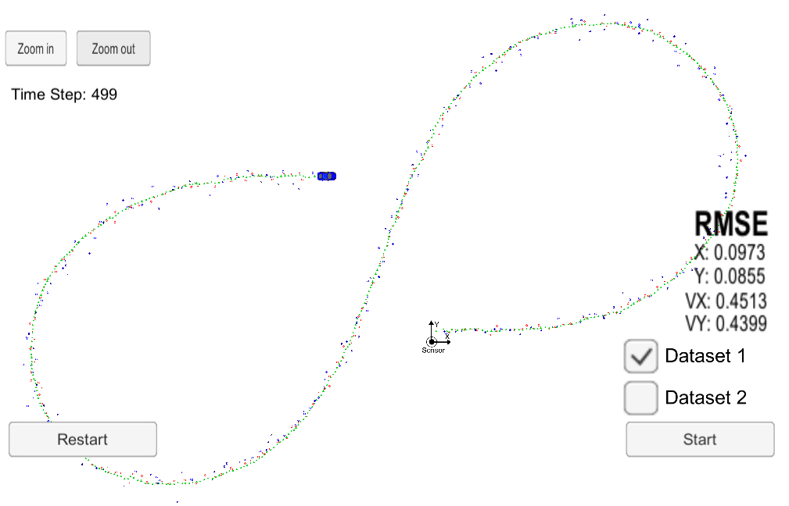

# Extended Kalman Filter Project
This Project is the sixth task (Project 1 of Term 2) of the Udacity Self-Driving Car Nanodegree program. The main goal of the project is to apply Extended Kalman Filter to estimate the state of a moving object of interest with noisy lidar and radar measurements using C++. Passing the project requires obtaining RMSE values that are lower that the tolerance outlined in the project rubric. 

The project was created with the Udacity [Starter Code](https://github.com/udacity/CarND-Extended-Kalman-Filter-Project).

This project involves the Term 2 Simulator which can be downloaded [here](https://github.com/udacity/self-driving-car-sim/releases).

Once the install for uWebSocketIO is complete, the main program can be built and run by doing the following from the project top directory.

1. `mkdir build`
2. `cd build`
3. `cmake ..`
4. `make`
5. `./ExtendedKF`

Tips for setting up your environment can be found [here](https://classroom.udacity.com/nanodegrees/nd013/parts/40f38239-66b6-46ec-ae68-03afd8a601c8/modules/0949fca6-b379-42af-a919-ee50aa304e6a/lessons/f758c44c-5e40-4e01-93b5-1a82aa4e044f/concepts/23d376c7-0195-4276-bdf0-e02f1f3c665d).

---

## Other Important Dependencies

* cmake >= 3.5
  * All OSes: [click here for installation instructions](https://cmake.org/install/)

* make >= 4.1 (Linux, Mac), 3.81 (Windows)
  * Linux: make is installed by default on most Linux distros
  * Mac: [install Xcode command line tools to get make](https://developer.apple.com/xcode/features/)
  * Windows: [Click here for installation instructions](http://gnuwin32.sourceforge.net/packages/make.htm)

* gcc/g++ >= 5.4
  * Linux: gcc / g++ is installed by default on most Linux distros

  * Mac: same deal as make - [install Xcode command line tools](https://developer.apple.com/xcode/features/)

  * Windows: recommend using [MinGW](http://www.mingw.org/)

This repository includes two files that can be used to set up and install [uWebSocketIO](https://github.com/uWebSockets/uWebSockets) for either Linux or Mac systems. For windows you can use either Docker, VMware, or even [Windows 10 Bash on Ubuntu](https://www.howtogeek.com/249966/how-to-install-and-use-the-linux-bash-shell-on-windows-10/) to install uWebSocketIO. Please see [this concept in the classroom](https://classroom.udacity.com/nanodegrees/nd013/parts/40f38239-66b6-46ec-ae68-03afd8a601c8/modules/0949fca6-b379-42af-a919-ee50aa304e6a/lessons/f758c44c-5e40-4e01-93b5-1a82aa4e044f/concepts/16cf4a78-4fc7-49e1-8621-3450ca938b77) for the required version and installation scripts.

## Basic Build Instructions

1. Clone this repo.
2. Make a build directory: `mkdir build && cd build`
3. Compile: `cmake .. && make` 
   * On windows, you may need to run: `cmake .. -G "Unix Makefiles" && make`
4. Run it: `./ExtendedKF `
5. Run Term 2 Simulator and then `Project 1/2: EKF and UKF` 

## Results

It is asked that RMSE should be less than or equal to the values [.11, .11, 0.52, 0.52].

The RMSE that I get are as following:

| Input | RMSE   |
| ----- | ------ |
| px    | 0.0973 |
| py    | 0.0855 |
| vx    | 0.4513 |
| vy    | 0.4399 |

